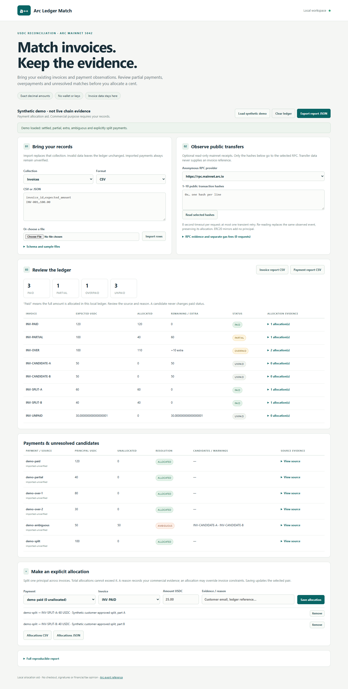

# Arc Ledger Match

A local allocation tool for existing USDC invoices. Import invoice records and
payment observations, inspect incomplete or ambiguous matches, explicitly split
a payment, and export the evidence behind each invoice status.

The browser processes invoice metadata in memory. Only public transaction hashes
you select go to the chosen Arc mainnet RPC. No account, wallet connection, key,
signature, transfer, analytics or runtime dependency is involved.

## Run

Requires Node.js **20.19+** (22 recommended), npm and a modern browser.

```sh
git clone https://github.com/kuilef/arc-ledger-match.git
cd arc-ledger-match
npm ci --ignore-scripts
npm run build
npm start
```

Open **http://127.0.0.1:5194**. The server binds only to loopback. Use another port
if occupied: `PORT=5195 npm start` on Linux/macOS, or
`$env:PORT='5195'; npm start` in PowerShell. Do not stop other processes.

The synthetic demo loads immediately: one referenced paid invoice, one partial,
one overpaid, two ambiguous candidates, two invoices paid by an explicit split,
and one unpaid invoice with 18-decimal precision. Every demo payment is labeled
unverified. No RPC is called until you select hashes and press the read button.

## Input schema

CSV with a header row, or JSON arrays. **Money is a decimal string**, never a
JSON number or exponent. Amounts must be positive with at most 18 decimals.
Optional fields can be absent or empty. Unknown fields are rejected.

| Collection | Required | Optional |
| --- | --- | --- |
| Invoices | `invoice_id`, `expected_amount` | `sender`, `receiver`, `start_at`, `end_at` |
| Payments | `payment_id`, `amount` | `sender`, `receiver`, `occurred_at`, `invoice_id` |
| Explicit allocations | `invoice_id`, `payment_id`, `amount`, `reason` | none |

Addresses use `0x` plus 40 hex digits. Dates are ISO UTC, such as
`2026-10-08T00:00:00Z`. A window requires an observed timestamp for matching.
Each collection is bounded to 5,000 rows and each import to 2 MB.
The report permits at most 5,000 candidate links in total. An operation that
exceeds this budget is rejected before replacing the current ledger or RPC
evidence. Narrow sender/receiver/date filters or split the input into batches.

Stable payment IDs prevent reuse of the same imported observation. The `arc:`
namespace is reserved for RPC evidence. Imports cannot claim RPC provenance.
Duplicate observations under unrelated IDs cannot be recognized from amounts
alone: deduplicate your source ledger and do not import an observation again
through RPC. Report CSVs contain extra evidence fields and are review exports;
use the supplied input schema to import. **Allocations JSON supports lossless
re-import.** CSV exports are for spreadsheet review. They prefix formula-leading
text with `'`, including IDs such as `-INV` and reasons such as `=reference`, so
exported CSV may no longer match the original IDs. Import preserves apostrophes;
it cannot safely distinguish spreadsheet protection from legitimate input text.

## How conclusions work

- Amount, address and time hints yield **candidates only**, even if unique.
- An imported `invoice_id` is an attribution asserted by your local records.
  It can allocate the remainder when invoice constraints agree. It never
  turns an imported payment into verified blockchain evidence.
- Explicit allocations take priority, require a reason, and may split a
  payment across invoices. Their sum cannot exceed that payment's principal.
  An explicit constraint override is flagged for review.
- `paid`, `partial` and `overpaid` mean allocated amounts in this ledger.
  They do not certify commercial settlement, tax treatment or financial audit.

The JSON report includes inputs, applied allocations, candidate lists,
provenance, separate transaction fees, and raw timestamped RPC observations.
For a reproducible check, parse the imported arrays with `invoicesFrom`,
`paymentsFrom`, `allocationsFrom`; decode each saved receipt/block observation
with `decodeReceipt`; then call `reconcile` in `dist/src/domain.js`.

## Arc-specific support

Mainnet chain **5042** only. The 18-decimal system `Transfer` stream supplies
principal. ERC20 USDC's 6-decimal stream is mirror evidence, never extra value.
Distinct system log identities remain separate; identical duplicate logs
collapse and conflicting duplicates reject. Gas is calculated separately as
`gasUsed × effectiveGasPrice` at 18 decimals.

ERC20-only or mismatched mirrors, legacy testnet events, mint/burn/self/zero
events, removed logs and malformed evidence are excluded or flagged. No
historical scanning or finality proof is implemented. Read-only RPC observations
are provider assertions. A transfer contains no invoice-specific commercial
reference. The reader accepts at most 10 hashes, requests sequentially, checks
chain and receipt/block coherence, has an 8-second timeout and one transient
retry. See [Arc events](https://docs.arc.io/arc/references/usdc-system-events),
[RPC endpoints](https://docs.arc.io/arc/references/rpc-endpoints) and
[connection details](https://docs.arc.io/arc/references/connect-to-arc).
RPC requests reject redirects, preventing a provider redirect from forwarding
selected hashes to another origin.

Re-reading a selected hash replaces its observed group, never adds it again.
Unavailable/unsupported evidence is removed from the current ledger; affected
explicit allocations are invalidated with a warning. An RPC-wide failure before
chain verification leaves the previous ledger unchanged and displays an error.
Snapshots remain time-stamped observations. RPC history is capped at 1,000
requests per session; export before extended use.

## Verify

```sh
npm run validate     # ESLint + strict TypeScript + build + node:test
npm run test:ui      # installed Chrome, own temporary loopback server
npm run smoke:rpc    # optional small public mainnet probe, overwrites local evidence
npm audit --audit-level=high
```

For machines without Chrome, install the test browser locally with
`npx --no-install playwright install chromium`, then run `PW_CHANNEL=chromium
npm run test:ui` (PowerShell: `$env:PW_CHANNEL='chromium'; npm run test:ui`).
CI tests Chromium. Live RPC is deliberately outside CI.

See [verification evidence](docs/VERIFICATION.md),
[Russian manual](MANUAL_RU.md), [grant preparation](GRANTS_RU.md),
[prior art and sources](docs/SOURCES.md) and [security limits](SECURITY.md).
Own source: MIT. No source was copied from the prior-art repositories.
Public hosting and grant submission are user-only steps; neither has been done.


